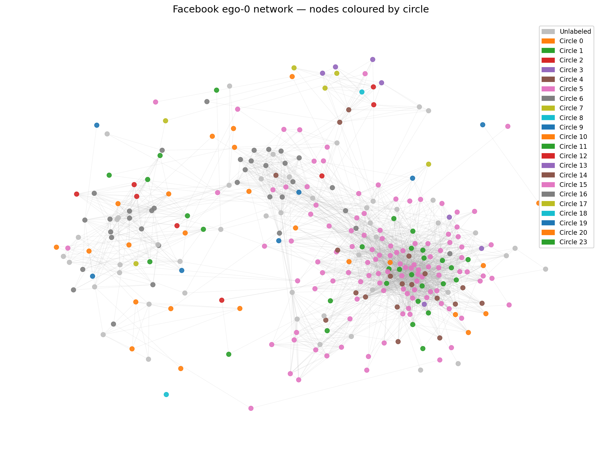
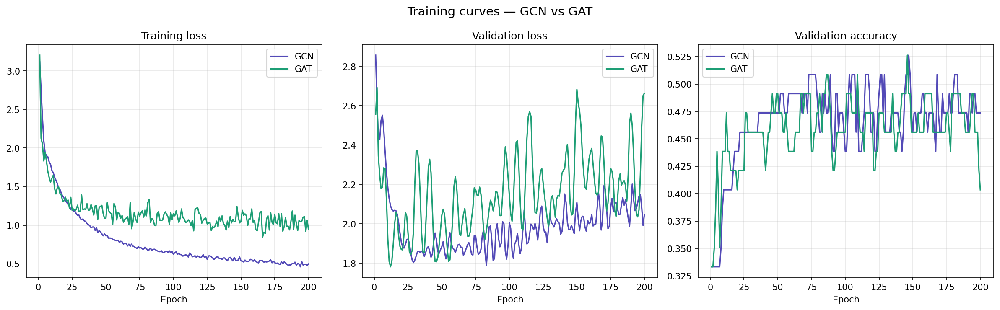
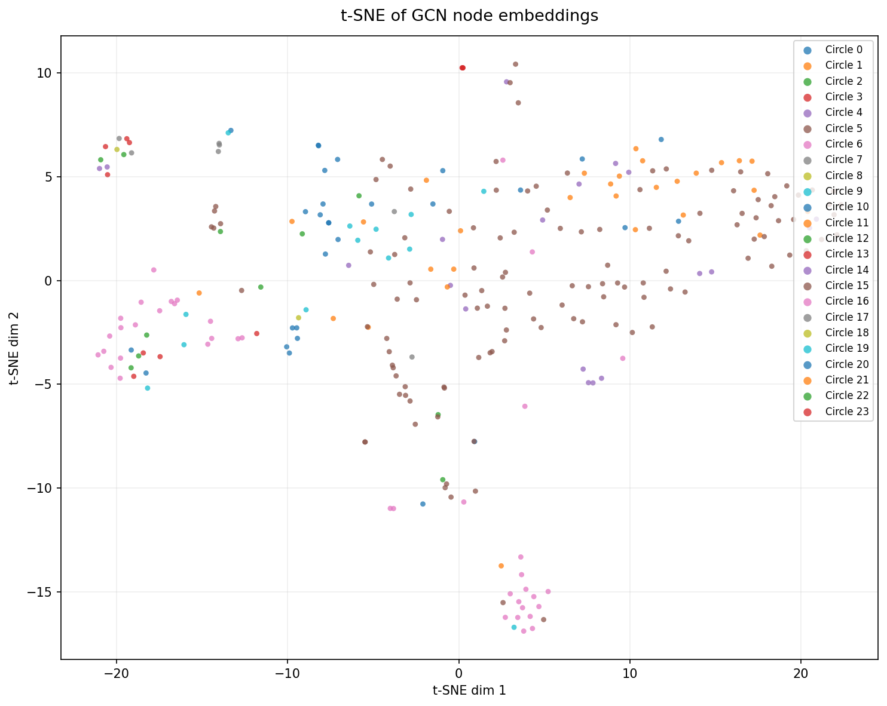
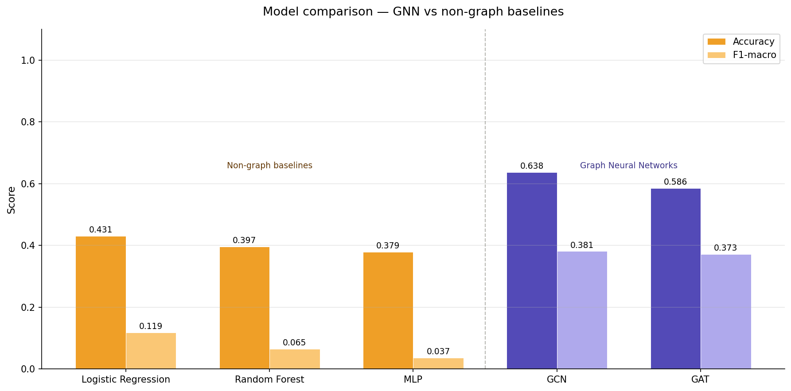
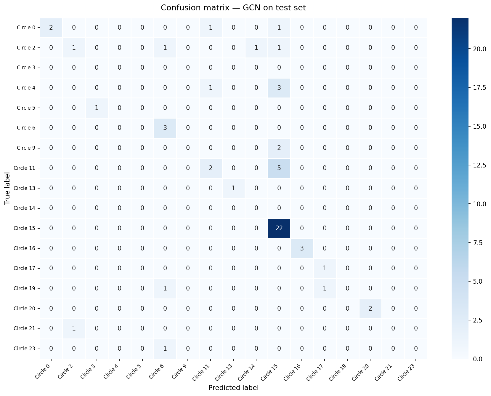

# GNN Facebook Social Circles — Node Classification

[](https://colab.research.google.com/github/AslamMd-17/GNN-Facebook-Social-Circles/blob/main/notebooks/01_data_loading.ipynb)


## Overview

This project applies **Graph Neural Networks (GCN and GAT)** to the
[Facebook Social Circles dataset](https://snap.stanford.edu/data/ego-Facebook.html)
from Stanford SNAP to predict which social circle (community group) a user belongs to.

The core question: **does modelling friendship connections as a graph improve
community detection over traditional ML that only sees user profile features?**

**Answer: Yes — by over 20 percentage points.**

---

## Dataset

| Property | Value |
|---|---|
| Source | Stanford SNAP — Facebook ego networks |
| Nodes | 4,039 users |
| Edges | 88,234 friendships |
| Node features | 1,406 anonymized profile attributes |
| Classes | 24 social circles |
| Task | Node classification |

---

## Project Structure
```
gnn-facebook-social-circles/
├── notebooks/
│   ├── 01_data_loading.ipynb    ← data loading, graph construction, ego network viz
│   ├── 02_gnn_model.ipynb       ← GCN + GAT models, training curves, t-SNE
│   └── 03_baselines.ipynb       ← LR, RF, MLP baselines + comparison
├── outputs/
│   ├── ego0_network.png
│   ├── training_curves.png
│   ├── tsne_embeddings.png
│   ├── model_comparison.png
│   └── confusion_matrix.png
└── README.md
```

---

## Results

| Model | Accuracy | F1-macro | Type |
|---|---|---|---|
| Logistic Regression | 0.4310 | 0.1188 | Non-graph baseline |
| Random Forest | 0.3966 | 0.0654 | Non-graph baseline |
| MLP | 0.3793 | 0.0367 | Non-graph baseline |
| GCN | **0.6379** | **0.3813** | Graph Neural Network |
| GAT | 0.5862 | 0.3726 | Graph Neural Network |

**GCN outperforms the best baseline (Logistic Regression) by +20.69% accuracy
and +26.25% F1-macro — confirming that graph structure is critical for
community detection in social networks.**

---

## Visualizations

### Ego network — nodes coloured by circle


### Training curves — GCN vs GAT


### t-SNE of learned GCN node embeddings


### Model comparison — GNN vs baselines


### Confusion matrix — best model (GCN)


---

## Graph Construction

Each user is a **node** with a 1,406-dimensional anonymized feature vector.
Each friendship is an **edge** — undirected, no edge weights.
Circle membership is the **label** — assigned by first-listed circle per node.

Train / Val / Test split: **60% / 20% / 20%** over labeled nodes only.

---

## Models

### GCN — Graph Convolutional Network
- 2-layer GCN using `GCNConv` from PyTorch Geometric
- Hidden dimension: 128
- Aggregates features from all neighbours with equal weights
- Dropout: 0.5, Optimizer: Adam, Epochs: 200

### GAT — Graph Attention Network
- 2-layer GAT using `GATConv`
- Layer 1: 8 attention heads × 64 hidden dims
- Layer 2: 1 head for final classification
- Learns which neighbours contribute more — key advantage over GCN
- Dropout: 0.6, Optimizer: Adam, Epochs: 200

### Non-graph baselines
- **Logistic Regression** — sklearn, max_iter=1000
- **Random Forest** — 100 estimators, sklearn
- **MLP** — 2 layers (256 → 128), sklearn, no graph structure

All baselines trained on raw node features only — no graph edges used.

---

## How to Run

1. Open any notebook via the **Open in Colab** badge above
2. Run Cell 1 to install dependencies
3. Mount Google Drive and upload SNAP dataset files
4. Run all cells in order: 01 → 02 → 03

**Dataset download:**
https://snap.stanford.edu/data/ego-Facebook.html

---

## Tech Stack

| Library | Purpose |
|---|---|
| PyTorch Geometric | GNN implementation |
| NetworkX | Graph construction + visualization |
| scikit-learn | Baseline models + evaluation metrics |
| matplotlib / seaborn | All visualizations |
| Google Colab | Training environment (T4 GPU) |

---

## Key Findings

- GNNs dramatically outperform feature-only models on this task
- GCN outperforms GAT — likely because the ego network has relatively
  uniform neighbour importance, so attention heads add noise rather than signal
- t-SNE visualization shows GCN learns well-separated embeddings per circle
- Low F1 scores on baselines indicate they struggle with class imbalance
  across 24 circles — GCN handles this far better via neighbourhood aggregation

---

## Resume Summary

> Built GCN and GAT models on the Facebook Social Circles dataset (4,039 nodes,
> 88,234 edges) achieving **63.79% node classification accuracy**, outperforming
> MLP and Logistic Regression baselines by **+20.69%**. Implemented full pipeline
> from raw SNAP data to PyTorch Geometric graph construction, model training,
> t-SNE embedding visualization and baseline comparison across 5 models.

---

*Dataset: Stanford SNAP — https://snap.stanford.edu/data/ego-Facebook.html*
